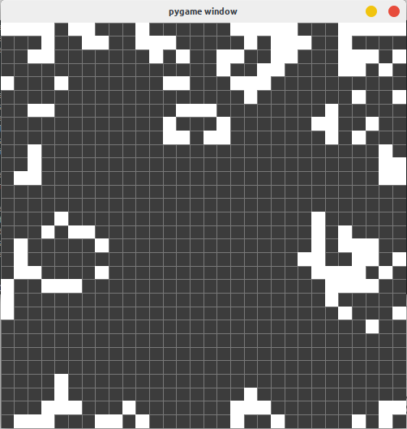

# Game of Life

**Python hooby code.**

* 1. Download
* 2. Run python file
```Bash
python ./GameofLife.py
```
or
```Bash
python3 ./GameofLife.py
```
* 3. Use the keyboard for PAUSE
* 4. Use mouse for draw new cells (in pause mode)
* 5. Enjoy!

The notebook code it's a simple explanation.
